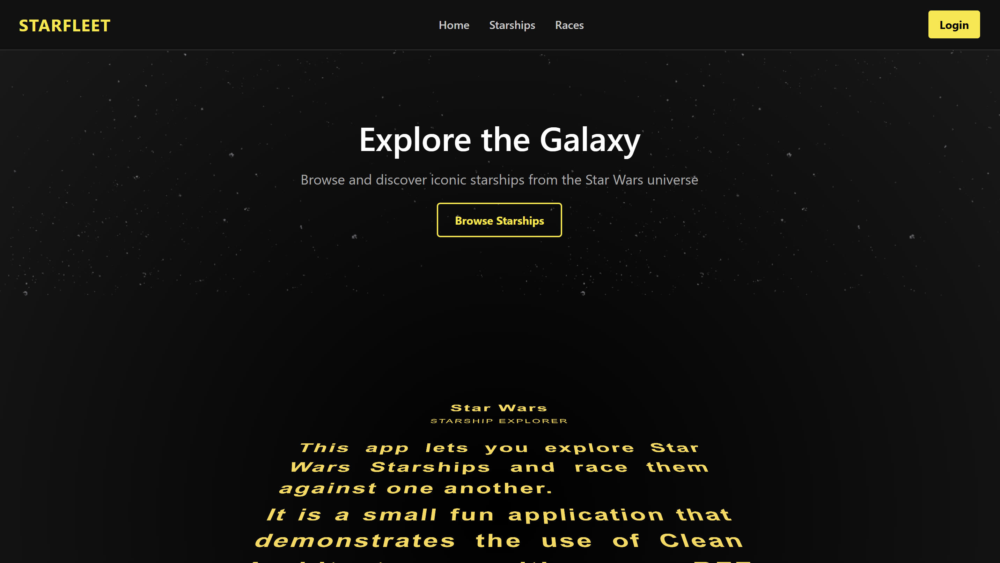
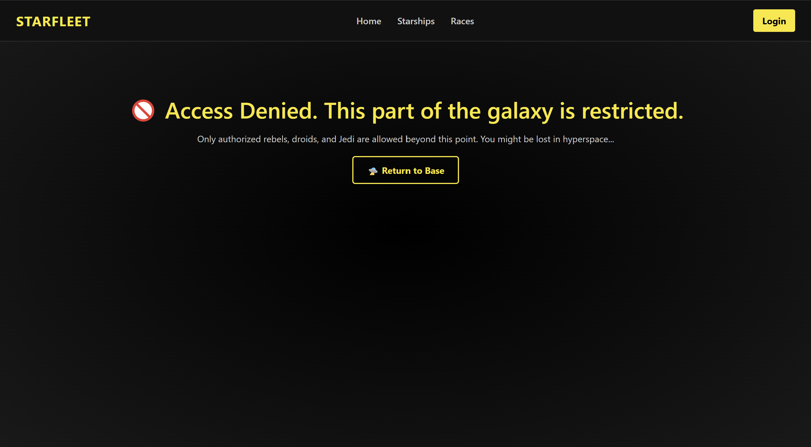
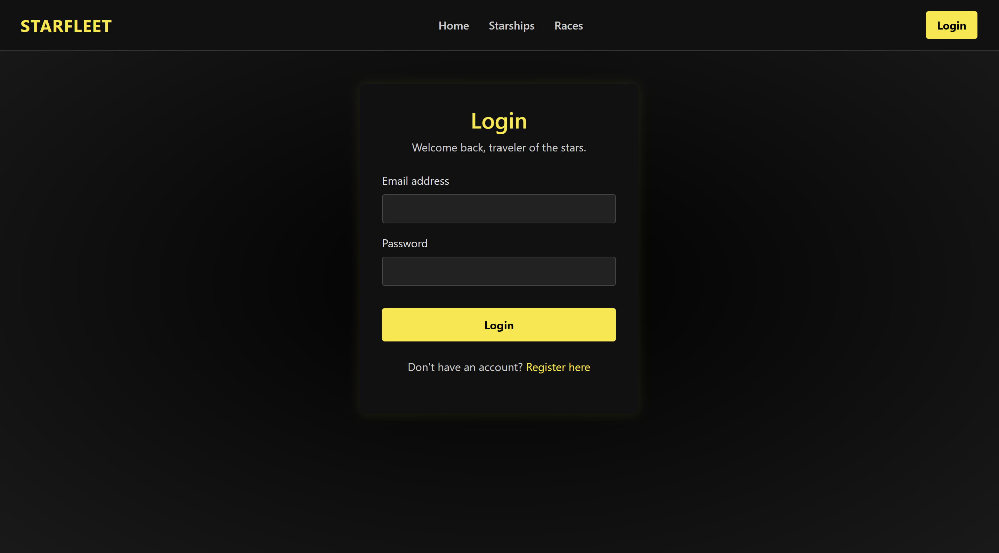
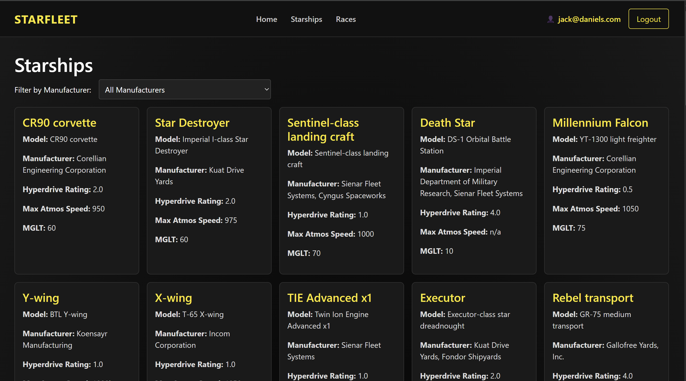
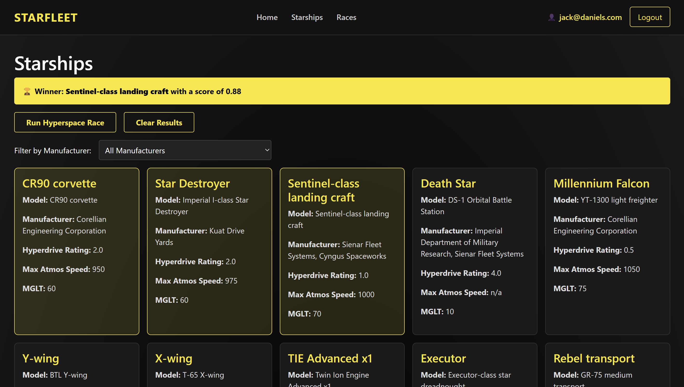

# 🌌 Star Wars Explorer

**Star Wars Explorer** is a full-stack Blazor application that showcases starships from the Star Wars universe, pulling real data from the [SWAPI](https://swapi.info) via a .NET API acting as a Backend-for-Frontend (BFF). It includes user registration, authentication, and a hyperspace race simulator based on ship stats.

---

## 🛠️ Tech Stack

- **Frontend**: Blazor Web (Server/Interactive)
- **API Layer**: ASP.NET Core with BFF pattern
- **Authentication**: ASP.NET Core Identity + JWT
- **Data Source**: [SWAPI.info](https://swapi.info)
- **Architecture**: Clean Architecture (5-layered project)

---

## 📁 Project Structure

```
swexplorer/
├── swexplorer.api            # BFF API layer (proxy + auth)
├── swexplorer.client         # Blazor UI (interactive)
├── swexplorer.application    # Business logic and services
├── swexplorer.core           # Domain models and interfaces
├── swexplorer.infrastructure # Data access and external dependencies
```

---

## 🚀 Features

- ✅ Starship listing with filtering by manufacturer
- ✅ Interactive selection and comparison
- ✅ Composite speed scoring (MGLT + hyperdrive + atmospheric)
- ✅ User registration and login with JWT
- ✅ Auth-protected pages (`AuthorizeView`)
- ✅ Custom authentication state provider
- ✅ Responsive UI with selectable starship cards

---

## 🛆 Getting Started

### 1. Clone the repository

```bash
git clone https://github.com/YOUR-USERNAME/swexplorer.git
cd swexplorer
```

### 2. Restore dependencies

```bash
dotnet restore
```

### 3. Run the application

```bash
dotnet run --project swexplorer.api -lp https
```

> The API should be available at `https://localhost:7257`

---

```bash
dotnet run --project swexplorer.client -lp https
```

> The APP should be available at `https://localhost:7160`

---

## ⚙️ Configuration

Update `appsettings.json` (or use `IConfiguration`) in `swexplorer.api` to configure the SWAPI endpoint or JWT settings.

---

## 📷 Screenshots







---

## 🤝 Contributing

Feel free to open issues or submit pull requests. This project is for learning, creativity, and fun!

---

## 📄 License

MIT © 2025 Bala Sultan